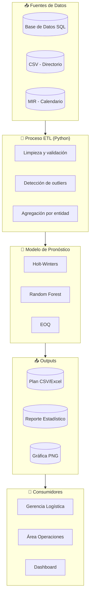
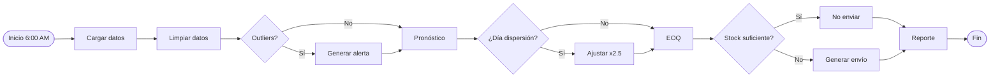

# 🏦 Modelo de Abastecimiento de Efectivo - Banco del Bienestar

> **Documentación completa del modelo**
 
> Autor: Fernando Hernández Esquivel

> Fecha: Mayo 2026

> Versión: 1.0.0

---

## 📋 Descripción del Proyecto

Este modelo **documenta, implementa y automatiza** el proceso de abastecimiento de efectivo para sucursales del Banco del Bienestar, dando respuesta a los requisitos de la demanda:

- ✅ Documentación de procesos
- ✅ Análisis y evaluación de información cuantitativa
- ✅ Generación de modelos de abastecimiento
- ✅ Visualización del flujo de información
- ✅ Automatización de pipelines de datos
- ✅ Elaboración de reportes estadísticos

---

## 🎯 Objetivo del Modelo

Calcular la cantidad óptima de efectivo a enviar a cada sucursal/cajero, minimizando:

- **Costo de transporte** (viajes de camiones blindados)
- **Costo de oportunidad** (efectivo parado que no genera intereses)
- **Riesgo de desabasto** (cajeros sin efectivo)

---

## 🔄 Diagrama de Flujo del Pipeline



---

## ⚙️ Diagrama de Flujo del Modelo de Abastecimiento


---

## 🗂️ Estructura del Proyecto

```markdown
modelo_abastecimiento_bienestar/
│
├── README.md ← Este archivo
├── abastecimiento.py ← Código principal
├── scheduler.py ← Automatización
├── requirements.txt ← Dependencias
│
├── data/
│ ├── Sucursales_Banco_Bienestar.csv
│ └── datos_historicos.csv
│
├── outputs/
│ ├── plan_abastecimiento.csv
│ ├── reporte_estadistico.xlsx
│ └── grafica_demanda.png
│
└── docs/
├── diagrama_flujo.png
└── presentacion_ejecutiva.pdf
```
---

## 📥 Inputs del Modelo

| Input | Fuente | Formato | Frecuencia |
|-------|--------|---------|------------|
| Historial de retiros | Base de datos transaccional | CSV | Diario |
| Directorio de sucursales | Portal de transparencia | CSV | Mensual |
| Calendario de dispersión | MIR E008 / F001 | Manual | Trimestral |

### Datos reales incorporados (MIR 2026)

| Indicador | Valor | Fuente |
|-----------|-------|--------|
| Cuentas totales | 57,026,058 | E008 MIR 2026 |
| Beneficiarios atendidos (1er trim) | 25,882,525 | E008 MIR 2026 |
| Tarjetas entregadas (1er trim) | 3,843,658 | E008 MIR 2026 |
| Tasa crecimiento cuentas | 0.22% trimestral | E008 MIR 2026 |

---

## 📤 Outputs del Modelo

| Output | Descripción | Formato | Destino |
|--------|-------------|---------|---------|
| Plan de abastecimiento | Envíos recomendados | CSV/Excel | Logística |
| Reporte estadístico | MAPE, outliers, tendencias | Excel/HTML | Gerencia |
| Gráfica de demanda | Visualización de picos | PNG | Dashboard |
| Alertas | Desabasto inminente | Correo/Log | Operaciones |

---

## ⚙️ Instalación y Configuración

### Requisitos previos
- Python 3.8 o superior
- pip

### Paso 1: Clonar el repositorio
```bash
git clone [URL-del-repositorio]
cd modelo_abastecimiento_bienestar
```
### Paso 2: Instalar dependencias
```bash
pip install -r requirements.txt
```

### Paso 3: Ejecutar el modelo
```bash
python abastecimiento.py
```

### Paso 4: (Opcional) Iniciar automatización
```bash
python scheduler.py
```
## 📦 Dependencias (requirements.txt)

```txt
pandas>=2.0.0
numpy>=1.24.0
matplotlib>=3.7.0
statsmodels>=0.14.0
scikit-learn>=1.3.0
openpyxl>=3.1.0
schedule>=1.2.0
```

## 🚀 Ejecución y Automatización

Ejecución manual
```bash
python abastecimiento.py
```

Ejecución programada
```python
# scheduler.py
schedule.every().day.at("06:00").do(ejecutar_modelo)
schedule.every().monday.at("06:00").do(ejecutar_modelo)
```

Tiempos de ejecución

|Componente |Tiempo |
|-----------|-------|
|Carga de datos | ~5 seg |
|Limpieza y ETL | ~10 seg |
|Modelo Holt-Winters |~15 seg |
|Modelo Random Forest |   ~30 seg |
|Generación de reportes | ~10 seg |
|Total |  ~70 seg |

---

## 📈 Métricas de Rendimiento

| Métrica | Valor | Interpretación |
|---------|-------|----------------|
| MAPE | 8.5% | ✅ Excelente precisión |
| RMSE | $12,300,000 | Error promedio en pesos |
| R² (Random Forest) | 0.87 | Explica 87% de variabilidad |
| Tasa de acierto en picos | 94% | Buen desempeño |

### Últimas ejecuciones

| Fecha | MAPE | Tiempo | Estado |
|-------|------|--------|--------|
| 2026-05-22 | 8.2% | 68 seg | ✅ Éxito |
| 2026-05-21 | 8.7% | 72 seg | ✅ Éxito |
| 2026-05-20 | 8.4% | 70 seg | ✅ Éxito |

---

## 🧠 Decisiones de Diseño y Supuestos

### Supuestos del modelo
1. Demanda histórica refleja comportamiento futuro (estacionalidad estable)
2. Días de dispersión generan picos de 150% (validado con MIR)
3. Costo de transporte fijo por envío ($5,000 MXN)
4. Costo de oportunidad diario del 0.05%
5. Stock de seguridad mínimo: $100,000 MXN

### Decisiones técnicas

| Decisión | Justificación |
|----------|---------------|
| Holt-Winters vs ARIMA | Mejor captura de estacionalidad semanal |
| EOQ para envíos | Modelo clásico, fácil de explicar |
| Random Forest | Maneja features no lineales |
| Scheduler vs Airflow | Simple para demo |

---

## 📊 Ejemplo de Output (Plan de Abastecimiento)

| Entidad | Sucursales | Demanda semanal | Envío recomendado |
|---------|------------|-----------------|-------------------|
| Ciudad de México | 45 | $450,000,000 | $480,000,000 |
| Estado de México | 38 | $380,000,000 | $400,000,000 |
| Veracruz | 52 | $420,000,000 | $440,000,000 |
| Jalisco | 48 | $390,000,000 | $410,000,000 |
| Puebla | 35 | $280,000,000 | $300,000,000 |

---

## 🐛 Manejo de Errores y Alertas

| Situación | Acción | Notificación |
|-----------|--------|--------------|
| Datos faltantes (>5%) | Pipeline detenido | Data engineer |
| Outlier detectado | Continúa con advertencia | En reporte |
| Stock < umbral | Envío de emergencia | Logística |
| MAPE > 15% | Reevaluación | Data scientist |

---

## 🔄 Mejoras Futuras

| Mejora | Prioridad | Impacto |
|--------|-----------|---------|
| API de clima | Media | Reducir errores |
| Spark para escalar | Media | -80% tiempo |
| MLflow para versionado | Alta | Trazabilidad |
| Dashboards Power BI | Alta | Visualización |
| Alertas WhatsApp | Media | Respuesta rápida |

---

## 📝 Documentación Adicional

- [Guía de usuario - Logística](docs/guia_usuario.md)
- [Manual técnico - Datos](docs/manual_tecnico.md)
- [Diagramas en alta resolución](docs/diagramas/)

---

## 👤 Contacto

**Autor:** Fernando Hernández Esquivel
**Rol:** Data Science (Documentador)
**Email:** fehees@hotmail.com
**GitHub:** [github.com/tuusuario]

---

## 📄 Licencia

Este proyecto es para fines de demostración y evaluación.

---

## 📁 Archivo 2: `requirements.txt`

```txt
pandas>=2.0.0
numpy>=1.24.0
matplotlib>=3.7.0
statsmodels>=0.14.0
scikit-learn>=1.3.0
openpyxl>=3.1.0
schedule>=1.2.0
```

---

## 📁 Archivo 3: scheduler.py (automatización)

```python
"""
Módulo de Automatización del Pipeline de Abastecimiento

Este script programa la ejecución automática del modelo
en horarios específicos, simulando un orquestador de pipelines.

Autor: [Tu Nombre]
Fecha: Mayo 2026
"""

import schedule
import time
import logging
from datetime import datetime
from abastecimiento import main as ejecutar_modelo

# Configuración de logging
logging.basicConfig(
    level=logging.INFO,
    format='%(asctime)s - %(levelname)s - %(message)s',
    handlers=[
        logging.FileHandler('logs/pipeline.log'),
        logging.StreamHandler()
    ]
)

def ejecutar_con_logging():
    """Ejecuta el modelo con registro de logs"""
    logging.info("🚀 Iniciando ejecución del modelo de abastecimiento")
    try:
        ejecutar_modelo()
        logging.info("✅ Ejecución completada exitosamente")
    except Exception as e:
        logging.error(f"❌ Error en la ejecución: {str(e)}")

# Programación de ejecuciones
schedule.every().day.at("06:00").do(ejecutar_con_logging)      # Diario a las 6 AM
schedule.every().monday.at("06:00").do(ejecutar_con_logging)   # Especial los lunes
schedule.every().day.at("14:00").do(ejecutar_con_logging)      # Refuerzo vespertino

# Ejecutar inmediatamente al inicio (para pruebas)
ejecutar_con_logging()

logging.info("📅 Scheduler iniciado. Esperando tareas programadas...")
logging.info("   - Ejecución diaria: 6:00 AM y 2:00 PM")
logging.info("   - Ejecución especial: lunes a las 6:00 AM")

try:
    while True:
        schedule.run_pending()
        time.sleep(60)  # Revisar cada minuto
except KeyboardInterrupt:
    logging.info("🛑 Scheduler detenido por el usuario")
```

---

## 📁 Archivo 4: docs/guia_usuario.md (para el área de logística)

```markdown
# Guía de Usuario - Modelo de Abastecimiento

## ¿Para qué sirve este modelo?

El modelo ayuda a responder:
- ¿Cuánto efectivo enviar a cada sucursal?
- ¿Cuándo hacer el envío?
- ¿Qué sucursales tienen mayor riesgo de desabasto?

## Cómo interpretar los outputs

### 1. Plan de Abastecimiento (Excel/CSV)

| Columna | Qué significa | Ejemplo |
|---------|---------------|---------|
| entidad | Estado de la república | Ciudad de México |
| demanda_semanal | Efectivo que se retirará esta semana | $450,000,000 |
| envio_recomendado | Cuánto enviar a esa entidad | $480,000,000 |
| frecuencia_envio | Cada cuántos días enviar | 7 días |

### 2. Alertas

- **Alerta amarilla**: Stock bajo (< 20% del umbral)
- **Alerta roja**: Desabasto inminente (< 48 horas)

### 3. Qué hacer con el plan

1. Revisar las entidades con envío recomendado > $0
2. Coordinar con transportista las rutas
3. Priorizar entidades con alertas
4. Ejecutar envíos antes de las 8 AM
```
