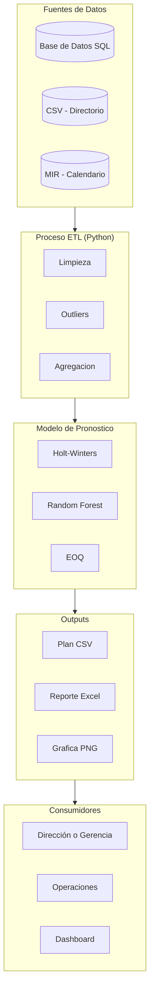
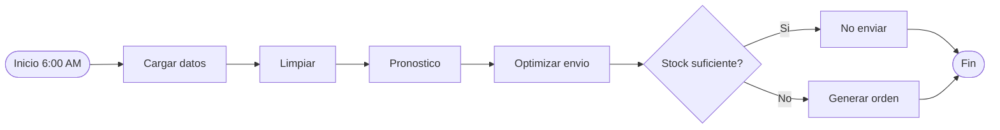

```mermaid
flowchart TB
    subgraph Fuentes["Fuentes de Datos"]
        A1[("Base de Datos SQL")]
        A2[("CSV - Directorio")]
        A3[("MIR - Calendario")]
    end

    subgraph ETL["Proceso ETL (Python)"]
        B1[Limpieza]
        B2[Outliers]
        B3[Agregacion]
    end

    subgraph Modelo["Modelo de Pronostico"]
        C1["Holt-Winters"]
        C2["Random Forest"]
        C3["EOQ"]
    end

    subgraph Outputs["Outputs"]
        D1["Plan CSV"]
        D2["Reporte Excel"]
        D3["Grafica PNG"]
    end

    subgraph Consumidores["Consumidores"]
        E1[Dirección o Gerencia]
        E2[Operaciones]
        E3[Dashboard]
    end

    Fuentes --> ETL --> Modelo --> Outputs --> Consumidores
```

```mermaid
flowchart LR
    INICIO([Inicio 6:00 AM]) --> DATOS[Cargar datos]
    DATOS --> LIMPIEZA[Limpiar]
    LIMPIEZA --> PRONOSTICO[Pronostico]
    PRONOSTICO --> OPTIMIZAR[Optimizar envio]
    OPTIMIZAR --> STOCK{Stock suficiente?}
    STOCK -->|Si| NO_ENVIO[No enviar]
    STOCK -->|No| ENVIO[Generar orden]
    NO_ENVIO --> FIN([Fin])
    ENVIO --> FIN
```

